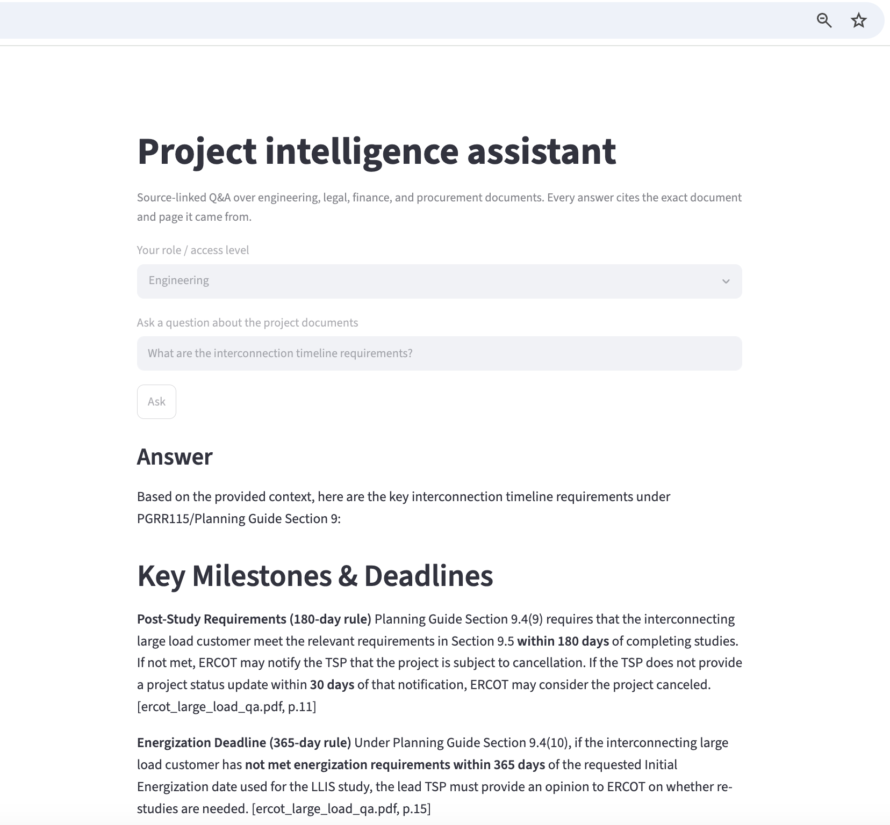
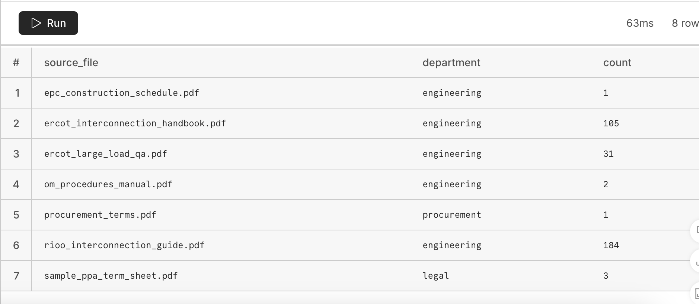

# Project Intelligence Assistant (RAG)

A citation-grounded Q&A system over engineering, legal, finance, and procurement documents. Every answer cites the exact source file and page it came from — built on the same embed-store-retrieve pattern that powers retrieval-augmented generation (RAG) in modern LLM applications.


---

## Overview

Engineering and infrastructure teams routinely need answers buried across design packages, contracts, schedules, and procurement terms — scattered documents that nobody has time to manually search. This project demonstrates a permission-aware retrieval system that answers natural-language questions and grounds every claim in a citation, rather than relying on an LLM's general knowledge.

**Stack:** Python · PostgreSQL + pgvector (Neon) · sentence-transformers (local embeddings) · Claude API · Streamlit

---

## Live demo



A user selects their access level (engineering, legal, finance, procurement, or admin), asks a question, and receives an answer with every factual claim tagged to its source document and page.

---

## Architecture

**Ingest → Embed → Store → Retrieve → Generate**

1. **Ingest** — PDFs are parsed page-by-page and split into overlapping ~220-word chunks, each tagged with source file, page number, and a department/access tag.
2. **Embed** — Each chunk is converted into a 384-dimension vector using a local, free `sentence-transformers` model (`all-MiniLM-L6-v2`) — no API cost, runs entirely on-device.
3. **Store** — Vectors and metadata are loaded into PostgreSQL with the `pgvector` extension, hosted free on Neon.
4. **Retrieve** — A question is embedded the same way, then matched via cosine similarity — filtered by department *before* the search runs, so a user only retrieves chunks they're permitted to see.
5. **Generate** — Retrieved chunks are passed to Claude with a strict system prompt: answer only from the provided context, cite every claim as `[source_file, p.page]`, and say so explicitly if the context doesn't contain the answer.

---

## Example output

**Question:** *"What are the interconnection timeline requirements?"*

> Based on the provided context, here are the key timeline requirements under PGRR115/Planning Guide Section 9:
>
> **Post-Study Requirements (180-day rule)** — the interconnecting large load customer must meet requirements within 180 days of completing studies. If not met, ERCOT may notify the TSP the project is subject to cancellation. [ercot_large_load_qa.pdf, p.11]
>
> **Energization Deadline (365-day rule)** — if energization requirements aren't met within 365 days of the requested date, the lead TSP must provide ERCOT an opinion on whether re-studies are needed. [ercot_large_load_qa.pdf, p.15]
>
> *Note: under the prior interim process, there was no requirement to energize by a particular date — this is a new requirement introduced by PGRR115.* [ercot_large_load_qa.pdf, p.15]


Every figure was pulled directly from source text and cited to its exact page — not generated from general knowledge about ERCOT processes. One retrieved chunk (the interconnection handbook overview) was judged irrelevant to this specific question and correctly excluded from the cited answer, rather than forced in just because it was retrieved.

---

## Permission-aware retrieval

Each document chunk carries a department tag (`engineering`, `legal`, `finance`, `procurement`). Filtering happens at the database query level, before generation — a user without legal access never receives legal chunks as retrieval candidates, let alone in a generated answer.



8 source documents, 328 chunks total, spanning all four department tags — confirmed loaded in the Neon-hosted vector database above.

---

## Why pgvector, and why two indexing strategies matter

Vector similarity search at scale requires specialized indexing — comparing a query against millions of vectors one by one is too slow. Two common approaches:

- **IVFFlat** — partitions vectors into clusters (via k-means); a query only searches the nearest clusters. Efficient on limited memory, best for static datasets that don't change often.
- **HNSW** — organizes vectors into a multi-layered graph, enabling fast coarse-to-fine search. Handles frequent updates well and gives higher accuracy, at the cost of more memory to hold the graph.

This project uses IVFFlat given the dataset's small, mostly-static size; a production system with frequent document updates would likely favor HNSW.

---

## Honest tradeoffs

- **Local embeddings over a paid API** — `all-MiniLM-L6-v2` is free and fast but a general-purpose model, not tuned for energy/legal/technical terminology. Similarity scores in testing landed in the 0.43–0.49 range — meaningfully above noise, but a domain-tuned or commercial embedding model (OpenAI, Voyage AI) would likely improve retrieval precision at scale.
- **Chunking is content-aware, not perfect** — short synthetic documents sometimes produced a single chunk per file, occasionally bundling table data together rather than splitting it. Not broken as answers remain accurate but a known area for refinement on long, table-heavy documents.
- **Entirely free infrastructure** — Neon (vector DB) and local embeddings carry zero ongoing cost; only Claude's generation step has a negligible per-query cost.

---

## What I'd build next

- Add reranking (a cross-encoder second pass) to improve precision on ambiguous queries
- Move from IVFFlat to HNSW if the document set grows or changes frequently
- Benchmark local embeddings against a commercial provider on this document set
- Replace the demo department-selector with real authenticated user roles
- Extend chunking to detect and handle tables as structured data rather than flattened text

---

## Run it yourself

```bash
pip install -r requirements.txt
# Set environment variables for Neon and Claude API credentials
python ingestion/embed_and_load.py   # ingest, embed, and load documents
streamlit run app/app.py             # launch the interactive demo
```
